# 🚀 pipex

## 📝 Overview

**pipex** is a Unix pipe implementation project from the 42 school curriculum. It recreates the behavior of the shell pipe operator `|` in C, teaching fundamental concepts of process management, file descriptors, and inter-process communication. The project includes both a mandatory part and a bonus version with extended functionality.

## 🔄 Project Logic

### 🛠️ Main Project (2 Commands)

The program takes 4 arguments and executes: `< file1 cmd1 | cmd2 > file2`

```bash
./pipex file1 cmd1 cmd2 file2
```

#### 📊 Flow Diagram

```mermaid
graph TD
    A["🚀 Pipex Main"] --> B{"Check arguments"}
    B -->|"Valid"| C["Create pipe"]
    B -->|"Invalid"| D["❌ Show error & exit"]
    
    C --> E["Fork processes"]
    
    E --> F["👶 First Child"]
    E --> G["👶 Second Child"]
    E --> H["👨‍👩‍👧‍👦 Parent"]
    
    F --> F1["Open input file"]
    F --> F2["Redirect stdin from file"]
    F --> F3["Redirect stdout to pipe"]
    F --> F4["Execute first command"]
    
    G --> G1["Open output file"]
    G --> G2["Redirect stdin from pipe"]
    G --> G3["Redirect stdout to file"]
    G --> G4["Execute second command"]
    
    H --> H1["Close pipe ends"]
    H --> H2["Wait for children"]
    H --> H3["Return exit status"]
```



#### 🧠 Implementation Steps

1. **🔍 Initialization**:
   - Parse arguments
   - Create a pipe
   - Fork two child processes

2. **👶 First Child Process**:
   - Redirect stdin from input file
   - Redirect stdout to pipe write end
   - Execute the first command

3. **👶 Second Child Process**:
   - Redirect stdin from pipe read end
   - Redirect stdout to output file
   - Execute the second command

4. **👨‍👩‍👧‍👦 Parent Process**:
   - Close pipe ends
   - Wait for child processes
   - Return the last command's exit status

### 🌟 Bonus Project

Extends functionality with:
- **Multiple Commands**: Support for 3+ commands in a pipeline
- **Heredoc**: Interactive input mode using `here_doc` limiter

```bash
# Multiple commands
./pipex_bonus file1 cmd1 cmd2 cmd3 ... outfile

# Heredoc mode
./pipex_bonus here_doc LIMITER cmd1 cmd2 ... outfile
```

#### 📊 Bonus Flow Diagram

```mermaid
graph TD
    A["🚀 Pipex Main"] --> B{"Check argc & argv[1]"}
    B -->|"argc == 5"| C["🟢 Process input file"]
    B -->|"argc != 5"| D["❌ Show usage & exit"]
    
    C --> E["heredoc_run_first_cmd()"]
    D --> F["🔴 Exit program"]
    
    E --> G["Read lines from STDIN"]
    F --> Z["End"]
    
    G --> H{"Line == delimiter?"}
    H -->|"No"| I["Write line to pipe fd[1]"]
    H -->|"Yes"| J["ropipe() & process first cmd"]
    
    I --> G
    
    J --> K["Open infile as prev_read"]
    
    K --> L["process_cmd[0]"]
    
    L --> M["Wait for commands"]
    
    M --> N{"i < 3 or 4 depending on mode"}
    
    N -->|"Yes"| O["ropipe()"]
    N -->|"No"| P["🟣 Last command"]
    
    O --> Q["process_cmd[i+1]"]
    Q --> M
    
    P --> R["run_last_cmd_and_wait_all()"]
    
    R --> S["Open outfile as pipe_fd[1]"]
    
    S --> T["process_cmd[last command]"]
    
    T --> U["wait() for all children"]
    
    U --> V["🟢 Exit"]
```



#### 🧠 Bonus Implementation

1. **🔍 Initialization**:
   - Parse arguments
   - Check for heredoc mode

2. **📝 Heredoc Handling**:
   - Create a pipe
   - Fork a child process for input
   - Read input until limiter is found
   - Write directly to the pipe

3. **⛓️ Process Chain**:
   - Create pipes between commands
   - Fork child processes for each command
   - Connect stdout/stdin between processes
   - Execute commands in their own processes

4. **🏁 Finalization**:
   - Wait for all processes
   - Return the exit status of the last command

## 🛡️ Error Handling

The project implements robust error handling with:

- **Exit Codes**:
  - 0: Success
  - 1: General error
  - 126: Permission denied
  - 127: Command not found
  - 128+n: Fatal error signal n

- **Error Messages**:
  - File errors: `pipex: filename: No such file or directory`
  - Command errors: `pipex: command: command not found`
  - System call errors: `pipex: function: error message`

## 🔨 Building & Testing

```bash
# Build main project
make

# Build bonus project
make bonus

# Build both
make && make bonus

# Clean
make clean

# Full clean
make fclean
```

## 🧩 Common Challenges & Solutions

### 🧟 Zombie Processes
**Challenge**: Child processes become zombies if exit status isn't collected.

**Solution**: Use `waitpid(-1, &status, 0)` to collect any child's exit status as soon as it terminates.

### 💧 Memory Leaks
**Challenge**: Dynamically allocated memory for command arguments can leak.

**Solution**: Implement a robust `ft_free` function to properly free all allocated memory.

### 🔍 Command Path Resolution
**Challenge**: Finding the correct executable path.

**Solution**: Search both current directory and PATH environment variable directories.

### ⚡ Signal Handling
**Challenge**: Properly handling signals from child processes.

**Solution**: Use `WIFEXITED`, `WEXITSTATUS`, `WIFSIGNALED`, and `WTERMSIG` macros to interpret termination status.

## 📚 Learning Resources

- 📹 [Unix Processes in C](https://www.youtube.com/watch?v=cex9XrZCU14)
- 📖 [Pipes in C](https://www.geeksforgeeks.org/pipe-system-call/)
- 📘 [Advanced Programming in the UNIX Environment](https://www.amazon.com/Advanced-Programming-UNIX-Environment-3rd/dp/0321637739)
- 🌐 [The Linux Programming Interface](https://man7.org/tlpi/)
- 📜 [POSIX Standard](https://pubs.opengroup.org/onlinepubs/9699919799/)

## 📦 Project Structure

```
pipex/
├── src/                  # Main project source files
├── src_bonus/           # Bonus project source files
├── libft/               # Custom library functions
├── test/                # Test scripts
└── Makefile             # Build system
```

## 📋 Dependencies

- GCC compiler
- Standard C libraries
- Unix/Linux environment
- Custom libft library (included)

---

😎 Happy coding and good luck with your pipex journey!